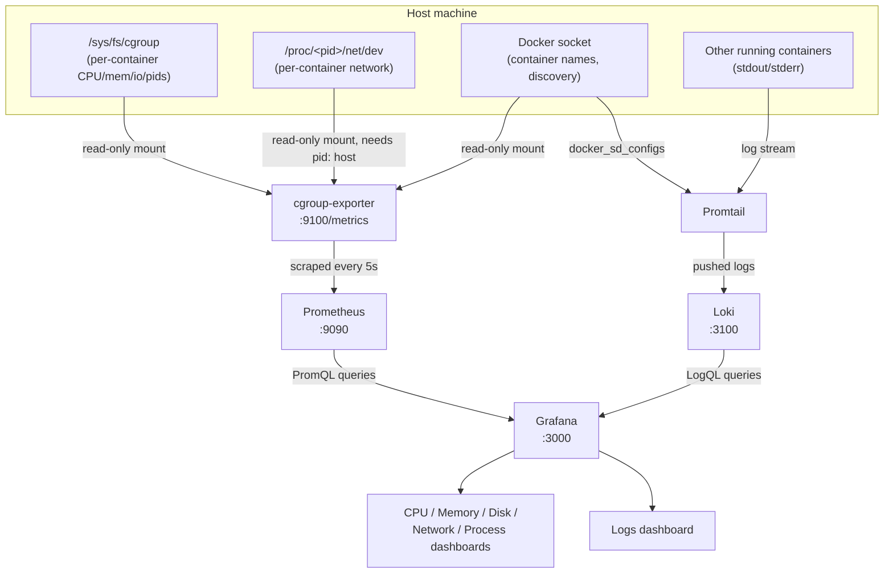

# Obstainer

A self-contained container observability stack: a custom exporter reads per-container
resource usage straight from the Linux cgroup v2 filesystem, Prometheus stores it,
Loki/Promtail collect logs, and Grafana visualizes everything in per-container dashboards.

## Stack overview

| Service           | Role                                                              | Port |
|-------------------|-------------------------------------------------------------------|------|
| `cgroup-exporter`  | Custom Go exporter, reads `/sys/fs/cgroup` and exposes Prometheus metrics | 9100 |
| `prometheus`       | Scrapes and stores metrics from `cgroup-exporter`                 | 9090 |
| `loki`             | Stores container logs                                             | 3100 |
| `promtail`         | Discovers running containers via the Docker socket and ships their logs to Loki | -    |
| `grafana`          | Dashboards for metrics (Prometheus) and logs (Loki)                | 3000 |

All services are wired together in [compose.yml](compose.yml).

## Data flow



1. `cgroup-exporter` reads raw cgroup v2 files and the Docker socket on the host, and turns
   them into Prometheus-formatted metrics.
2. `Prometheus` pulls (scrapes) those metrics every 5 seconds and stores them as time series.
3. `Promtail` separately watches the Docker socket for running containers and streams their
   logs into `Loki`.
4. `Grafana` queries Prometheus (PromQL) for the metrics dashboards and Loki (LogQL) for the
   Logs dashboard, rendering one panel per container in each.

## Running it

```bash
docker compose up -d --build
```

Then open Grafana at [http://localhost:3000](http://localhost:3000) (login: `admin` / `admin`,
set via `GF_SECURITY_ADMIN_PASSWORD` in compose.yml).

To stop everything:

```bash
docker compose down
```

Data persists across restarts in the named volumes `prometheus-data`, `grafana-data`, and
`loki-data`. To wipe Grafana's own state (dashboards/users/datasources) instead of just
restarting it, remove its volume: `docker volume rm obstainer_grafana-data`.

## How it works

### Metrics: reading cgroups directly

Docker doesn't expose per-container CPU/memory/disk/network/process counts as Prometheus
metrics out of the box. Rather than run a heavyweight tool like cAdvisor, `cgroup-exporter`
([cgroup-exporter/main.go](cgroup-exporter/main.go)) is a small Go program that reads the
numbers straight from cgroup v2 files:

- **CPU** — `cpu.stat`'s `usage_usec` (cumulative CPU time)
- **Memory** — `memory.current` (current usage in bytes)
- **Disk I/O** — `io.stat`'s `rbytes`/`wbytes` summed across devices
- **Processes** — `pids.current`

It walks `/sys/fs/cgroup` (bind-mounted read-only from the host into `/host/sys/fs/cgroup`)
looking for directories that look like a container cgroup (either `docker-<64hex>.scope`
for the systemd cgroup driver, or a bare `<64hex>` directory for the cgroupfs driver), then
maps each cgroup back to a human-readable container name by querying the Docker socket
(`/var/run/docker.sock`, mounted read-only).

**Network** is trickier: cgroup v2 has no per-cgroup network accounting. To get it anyway,
the exporter reads the first PID listed in each container's `cgroup.procs` and looks up that
PID's `/proc/<pid>/net/dev` (summing `rx`/`tx` bytes across all interfaces except loopback).
This only works because the exporter runs with `pid: host` in compose.yml — without sharing
the host PID namespace, it can't resolve real PIDs from other containers' cgroups, and every
container would read as zero.

The exporter serves everything as plain-text Prometheus metrics on `/metrics`:

- `cgroup_cpu_usage_seconds_total{container_name}` (counter)
- `cgroup_memory_usage_bytes{container_name}` (gauge)
- `cgroup_io_read_bytes_total` / `cgroup_io_write_bytes_total` (counters)
- `cgroup_pids{container_name}` (gauge)
- `cgroup_network_receive_bytes_total` / `cgroup_network_transmit_bytes_total` (counters)

Prometheus ([prometheus/prometheus.yml](prometheus/prometheus.yml)) scrapes this endpoint
every 5 seconds.

### Logs: Docker service discovery

Promtail ([promtail/promtail-config.yml](promtail/promtail-config.yml)) uses its built-in
`docker_sd_configs`, polling the Docker socket every 5 seconds to discover every running
container and stream its stdout/stderr straight into Loki — no log files or extra mounts
needed for the log content itself. Each log line is labeled with the container name
(`container`) and stream (`stdout`/`stderr`), which is what the Grafana Logs dashboard
filters on.

### Grafana dashboards

All dashboards live in [grafana/dashboards/](grafana/dashboards/) and are auto-provisioned
(see [grafana/provisioning/](grafana/provisioning/)) — nothing needs to be imported by hand.

- **CPU Usage**, **Memory Usage**, **Network Usage**, **Disk Usage**, **Number of Processes**
  — one dashboard per resource type. Each uses a Grafana template variable
  (`label_values(<metric>, container_name)`) driving a *repeating* panel, so every currently
  running container automatically gets its own full-width panel, stacked vertically. New
  containers show up with no dashboard edits required.
- **Logs** — same repeating-panel pattern, but backed by Loki: one panel per container
  showing its live log stream.
- **All Metrics** (`cgroup-metrics.json`) — a single overview dashboard combining CPU,
  memory, disk I/O, and PID panels side by side for a quick at-a-glance view.

Datasources are provisioned in [grafana/provisioning/datasources/](grafana/provisioning/datasources/):
Prometheus is pinned to a fixed `uid: prometheus` (dashboards reference it explicitly), while
Loki is referenced by datasource `type` only, so it resolves automatically without needing a
pinned uid.

## Adding a new dashboard/panel

Drop a new dashboard JSON file into `grafana/dashboards/` — the `dashboard.yml` provisioning
provider polls that folder every 10 seconds and picks it up automatically, no Grafana restart
needed.
